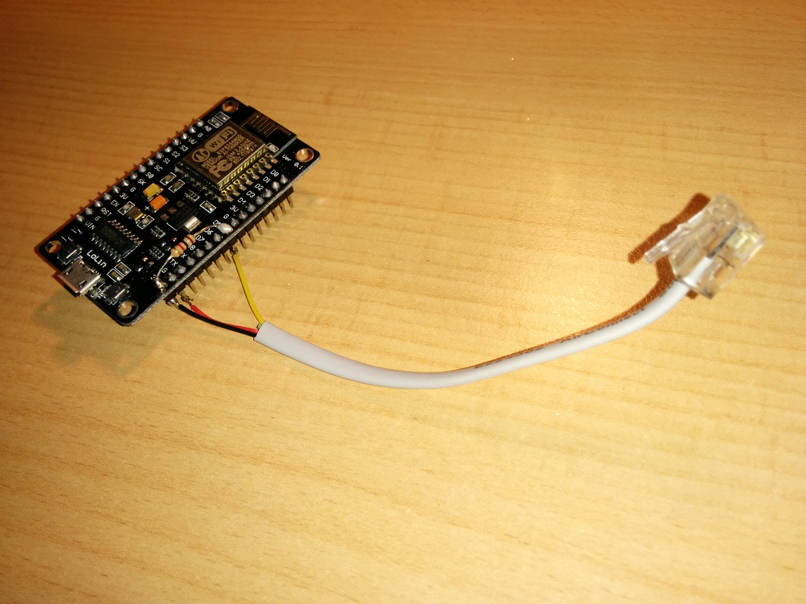

Hardware
========

My prikmeter is based on a LoLin NodeMCU "V3" board. According to
[this article](https://frightanic.com/iot/comparison-of-esp8266-nodemcu-development-boards/#v3),
there's no such thing as an "official" version 3 (as of October 2017); rather,
this is a V2 which has been tweaked a bit by LoLin.

I chose this board because it has a USB port, which can be used both for
flashing the firmware and for powering it. The latter is especially useful,
because I had plenty of USB power cables lying around (who doesn't?).

Smart meters
------------

All smart meters have a so-called "P1" port, which is just a 5 volt serial port
in the shape of an RJ11 socket. To make it tamper-proof, it's insulated from
the meter's internals using an optocoupler. Once every 10 seconds, the meter
outputs its internal state in the form of a "telegram", which is around 1 kB of
ASCII text in a particular format. See the [`doc`](../doc) directory for the
DSMR specification and an example telegram.

There is some variety in DSMR versions and meters. Here is a fairly
comprehensive
[overview on DomoticX](http://domoticx.com/p1-poort-slimme-meter-hardware/).
[This tutorial from Ge Janssen](http://gejanssen.com/howto/Slimme-meter-uitlezen/)
is also good reading material.
Finally, [jantenhove](https://github.com/jantenhove/P1-Meter-ESP8266) has a
very similar project.

In particular, most meters output an inverted signal, and so require either a
hardware inverter (a transistor and a couple of resistors) or a software
inverter (the Arduino `SoftSerial` library can do this).

Wiring
------

I was lucky, because my meter (the Landis + Gyr E350 ZMF110CBtFs2) does not
require an inverter. Furthermore, it works just fine with the 3.3 V from the
ESP8266, even though it officially works on 5 V. All that is needed for this
particular meter is a 1 kOhm resistor between the 3.3 V pin and the RxD (data)
pin.

Further wiring:

    RJ11  Function  Colour  ESP8266
    pin1  -         -       -
    pin2  RTS       black   3V
    pin3  GND       red     G
    pin4  -         green   -
    pin5  RxD/TxD   yellow  D5
    pin6  -         -       -

